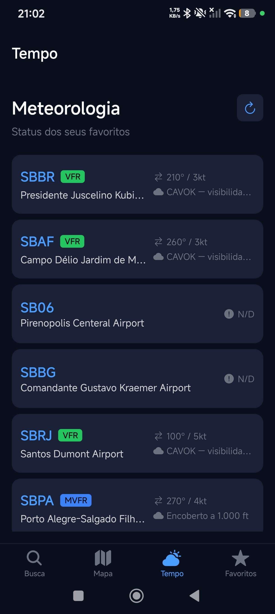
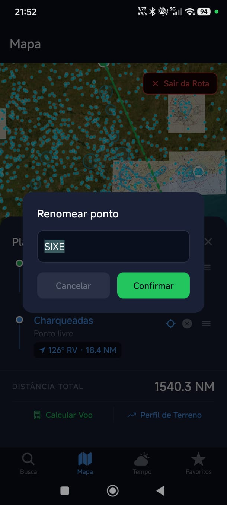
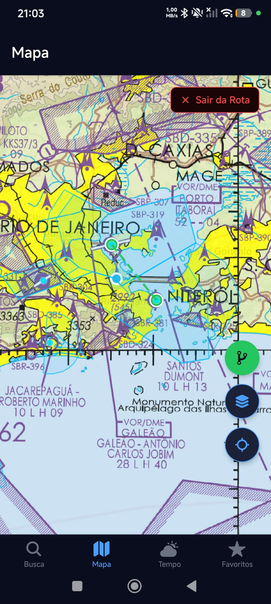
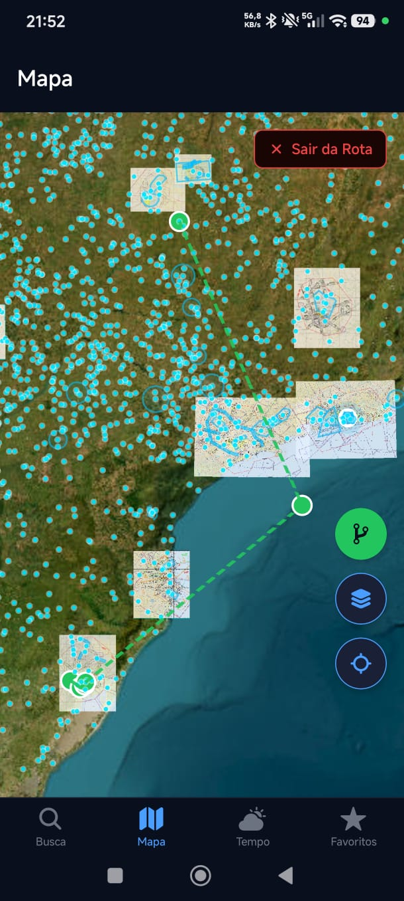
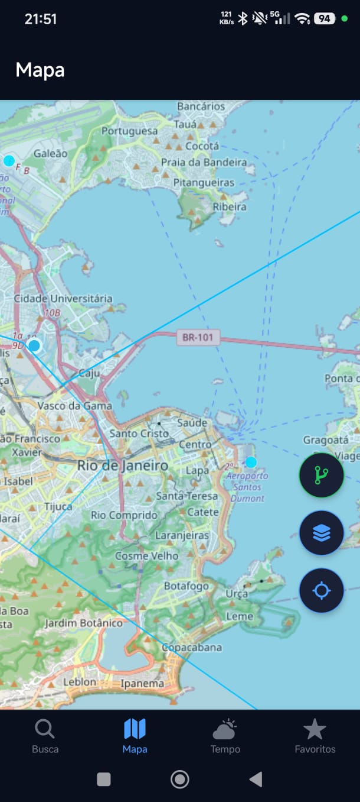

<p align="center">
  
</p>

<h1 align="center">NavGate</h1>

<p align="center">
  <strong>Planejamento de voo VFR para pilotos brasileiros.</strong>
</p>

<p align="center">
  Cartas aeronáuticas, meteorologia, planejamento de rota e navegação em um único aplicativo.
</p>

<p align="center">
  
  
  
  
</p>

<p align="center">
  Projeto de extensão universitária desenvolvido na Universidade Estácio de Sá — campus Maracanã.
</p>

---

## Sobre o NavGate

O **NavGate** nasceu da ideia de tornar o planejamento de voo VFR mais acessível para pilotos brasileiros.

Grande parte das soluções consolidadas de planejamento aeronáutico são pagas, cobradas em moeda estrangeira e desenvolvidas principalmente para outros mercados.

O projeto reúne em uma interface mobile recursos úteis para preparação e visualização de um voo VFR no Brasil, integrando dados meteorológicos, aeródromos, cartas aeronáuticas, espaços aéreos e ferramentas de cálculo de rota.

> [!IMPORTANT]
> O NavGate é um projeto acadêmico e não substitui fontes, publicações, procedimentos ou sistemas oficiais utilizados no planejamento e na execução de um voo. Sempre confirme as informações aeronáuticas em fontes oficiais antes da operação.

---

## Visão do aplicativo

As capturas abaixo são exibidas em tamanho reduzido propositalmente para representar melhor a experiência mobile do aplicativo.

<table>
  <tr>
    <td align="center" width="33%">
      <strong>METAR e TAF</strong>
    </td>
    <td align="center" width="33%">
      <strong>Planejamento de voo</strong>
    </td>
    <td align="center" width="33%">
      <strong>Favoritos</strong>
    </td>
  </tr>
  <tr>
    <td align="center">
      
    </td>
    <td align="center">
      
    </td>
    <td align="center">
      
    </td>
  </tr>
  <tr>
    <td align="center">
      <sub>Condições meteorológicas e previsão do aeródromo.</sub>
    </td>
    <td align="center">
      <sub>Tempo, combustível, distância e dados do planejamento.</sub>
    </td>
    <td align="center">
      <sub>Acesso rápido aos aeródromos acompanhados pelo piloto.</sub>
    </td>
  </tr>
</table>

<br>

<table>
  <tr>
    <td align="center" width="33%">
      <strong>Cartas WAC</strong>
    </td>
    <td align="center" width="33%">
      <strong>Mapa e satélite</strong>
    </td>
    <td align="center" width="33%">
      <strong>GPS</strong>
    </td>
  </tr>
  <tr>
    <td align="center">
      
    </td>
    <td align="center">
      
    </td>
    <td align="center">
      
    </td>
  </tr>
  <tr>
    <td align="center">
      <sub>Cartografia aeronáutica oficial sobreposta ao mapa.</sub>
    </td>
    <td align="center">
      <sub>Alternância entre mapa base, satélite e camadas aeronáuticas.</sub>
    </td>
    <td align="center">
      <sub>Posicionamento em tempo real durante a navegação.</sub>
    </td>
  </tr>
</table>

---

## Principais recursos

### Planejamento de rota

O piloto pode construir uma rota diretamente pelo mapa, selecionando aeródromos como waypoints.

O NavGate:

* calcula a distância de cada trecho em milhas náuticas;
* calcula o rumo verdadeiro entre os waypoints;
* exibe a distância total da rota;
* permite reorganizar os pontos por drag and drop;
* recebe velocidade de cruzeiro para estimar o tempo de voo;
* calcula informações de combustível e ETA;
* gera um perfil de elevação do terreno ao longo da rota;
* mantém o planejamento salvo mesmo após fechar o aplicativo.

Os cálculos de distância utilizam a **fórmula de Haversine**, considerando a curvatura da Terra para obter distâncias geográficas entre os waypoints.

---

### Mapa aeronáutico

O mapa é construído com **MapLibre React Native** e reúne diferentes fontes de informação em uma única interface.

Entre as camadas disponíveis estão:

* aeródromos brasileiros;
* cartas aeronáuticas WAC;
* cartas REA;
* espaços aéreos controlados;
* mapa OpenStreetMap;
* imagens de satélite;
* posição GPS do dispositivo;
* rota atualmente planejada.

As cartas aeronáuticas são obtidas através dos serviços WMS do **DECEA GeoAISWeb**.

---

### Meteorologia

O NavGate consulta informações meteorológicas aeronáuticas e apresenta os dados de forma mais amigável ao piloto.

Entre os recursos estão:

* METAR;
* TAF;
* condições meteorológicas atuais;
* interpretação dos dados do METAR;
* classificação automática das condições de voo;
* acesso aos dados por aeródromo.

As condições são classificadas como:

| Categoria | Condição                             |
| --------- | ------------------------------------ |
| **VFR**   | Condições favoráveis para voo visual |
| **MVFR**  | Condições visuais marginais          |
| **IFR**   | Condições de voo por instrumentos    |
| **LIFR**  | Condições IFR muito restritivas      |

Os dados meteorológicos são obtidos através do **NOAA Aviation Weather Center**.

---

### Aeródromos

O aplicativo utiliza uma base local com **4.609 aeródromos brasileiros**.

É possível pesquisar por:

* código ICAO;
* nome do aeródromo;
* cidade.

O NavGate também apresenta informações operacionais do aeródromo e oferece acesso às cartas publicadas no **AISWEB**.

---

### Favoritos

Aeródromos consultados frequentemente podem ser adicionados aos favoritos.

A tela de favoritos funciona como um pequeno dashboard, permitindo acompanhar rapidamente os aeródromos de interesse e suas condições meteorológicas.

Os favoritos são armazenados localmente utilizando **SQLite**.

---

## Tecnologias

### Aplicativo

| Tecnologia            |     Versão | Função                        |
| --------------------- | ---------: | ----------------------------- |
| React Native          |   `0.81.5` | Aplicativo mobile             |
| React                 |   `19.1.0` | Interface                     |
| Expo                  | `~54.0.33` | Toolchain e runtime           |
| Expo Router           |  `~6.0.23` | Navegação baseada em arquivos |
| TypeScript            |   `~5.9.2` | Tipagem estática              |
| MapLibre React Native |  `^10.4.2` | Renderização do mapa          |
| Zustand               |  `^5.0.12` | Estado global                 |
| AsyncStorage          |   `^3.1.0` | Persistência simples          |
| Expo SQLite           | `~16.0.10` | Banco local                   |
| Expo Location         |  `~19.0.8` | GPS                           |
| Victory Native        |  `^36.9.2` | Visualização de dados         |
| Reanimated            |  `^3.19.4` | Animações                     |
| Gesture Handler       |  `~2.28.0` | Gestos                        |
| Draggable FlatList    |   `^4.0.3` | Reordenação de waypoints      |

---

## Fontes de dados e serviços

| Serviço                      | Utilização          | Chave |
| ---------------------------- | ------------------- | :---: |
| NOAA Aviation Weather Center | METAR e TAF         |  Não  |
| DECEA GeoAISWeb WMS          | Cartas WAC e REA    |  Não  |
| OpenAIP                      | Espaços aéreos      |  Sim  |
| Open-Topo-Data               | Elevação do terreno |  Não  |
| OpenStreetMap                | Mapa base           |  Não  |
| Esri World Imagery           | Imagens de satélite |  Não  |

---

## Arquitetura

O projeto é organizado principalmente por **feature**, mantendo cada domínio do aplicativo com seus próprios componentes, serviços, hooks e tipos.

```text
NavGate/
├── assets/
│   ├── data/
│   ├── screenshots/
│   ├── icon.png
│   ├── adaptive-icon.png
│   └── splash-icon.png
│
├── scripts/
│   ├── airports.csv
│   └── processar_aerodromos.js
│
└── src/
    ├── app/
    │   ├── (tabs)/
    │   │   ├── index.tsx
    │   │   ├── mapa.tsx
    │   │   ├── meteorologia.tsx
    │   │   └── favoritos.tsx
    │   │
    │   ├── aerodromo/
    │   ├── metar/
    │   └── _layout.tsx
    │
    ├── constants/
    │
    ├── features/
    │   ├── aerodromos/
    │   ├── favoritos/
    │   ├── mapa/
    │   ├── metar/
    │   └── rota/
    │       ├── components/
    │       │   ├── CalculoVoo.tsx
    │       │   ├── PainelRota.tsx
    │       │   └── PerfilTerreno.tsx
    │       ├── hooks/
    │       └── services/
    │           ├── perfilTerreno.ts
    │           └── rotaService.ts
    │
    └── services/
```

Essa separação evita concentrar regras de negócio diretamente nas telas e facilita a evolução independente de cada recurso.

---

## Estado e persistência

### Rotas

O planejamento utiliza **Zustand** como estado global.

Com o middleware de persistência e o **AsyncStorage**, os waypoints da rota permanecem armazenados mesmo após o fechamento do aplicativo.

O estado temporário da interface, como o modo de edição da rota, não precisa ser persistido.

### Favoritos

Os favoritos utilizam **SQLite**, adequado para armazenar os registros estruturados dos aeródromos e realizar consultas locais.

---

## Configuração

### Pré-requisitos

Para desenvolvimento:

* Node.js;
* npm;
* Expo CLI através do `npx`;
* conta Expo/EAS;
* dispositivo Android ou emulador;
* chave da API OpenAIP.

---

### Instalação

Clone o repositório:

```bash
git clone https://github.com/Davi-Tlr/NavGate.git
cd NavGate
```

Instale as dependências:

```bash
npm install
```

---

### Variáveis de ambiente

Crie um arquivo `.env` na raiz:

```env
EXPO_PUBLIC_OPENAIP_KEY=sua_chave_aqui
```

A chave pode ser obtida gratuitamente através do OpenAIP.

Para cadastrar a variável nos builds EAS:

```bash
npx eas env:create \
  --name EXPO_PUBLIC_OPENAIP_KEY \
  --value SUA_CHAVE \
  --scope project \
  --visibility plaintext \
  --environment production \
  --environment preview
```

---

## Executando o projeto

> [!NOTE]
> O MapLibre utilizado pelo projeto depende de código nativo e, portanto, o aplicativo não deve ser executado pelo Expo Go.

### Development build

Gere o APK de desenvolvimento:

```bash
npx eas build -p android --profile development
```

Depois de instalar o APK no dispositivo, inicie o Metro:

```bash
npx expo start --clear
```

---

### Preview

Para gerar um APK standalone:

```bash
npx eas build -p android --profile preview
```

Os perfis de desenvolvimento e preview estão configurados através do `eas.json`.

---

## Decisões técnicas

### MapLibre e New Architecture

O projeto atualmente utiliza:

```json
"newArchEnabled": false
```

Essa configuração deve ser mantida enquanto a versão utilizada do MapLibre depender da arquitetura antiga do React Native.

---

### Reanimated 3

O projeto permanece na série `3.x` do Reanimated para manter compatibilidade com a configuração atual do React Native e MapLibre.

Versão utilizada:

```text
3.19.4
```

---

### WMS do DECEA

As cartas WAC são consumidas através do serviço WMS do GeoAISWeb.

Em vez de solicitar todas as camadas em uma única URL, o carregamento é dividido em grupos regionais para evitar requisições excessivamente longas.

A divisão utilizada é:

```text
Norte
Nordeste
Centro
Sudeste
Sul
```

---

### Cálculo geográfico

A distância entre dois waypoints é calculada utilizando **Haversine**.

O rumo retornado pelo planejamento é o **rumo verdadeiro**, medido em relação ao norte geográfico.

```text
Waypoint A
    │
    ├── distância em NM
    ├── rumo verdadeiro
    ▼
Waypoint B
```

Cada conjunto de trechos é então convertido para **GeoJSON `LineString`**, permitindo que a rota seja desenhada diretamente pelo MapLibre.

---

### Espaços aéreos

Os espaços aéreos são obtidos pela API do OpenAIP e convertidos para uma `FeatureCollection` GeoJSON antes de serem entregues ao MapLibre.

Isso mantém a integração do mapa independente do formato retornado pela API externa.

---

## Objetivo do projeto

O NavGate busca explorar como tecnologias mobile e fontes abertas ou oficiais de dados podem ser reunidas para criar uma experiência moderna de planejamento VFR voltada ao contexto brasileiro.

O projeto também serve como aplicação prática de conceitos como:

* desenvolvimento mobile com React Native;
* integração com APIs externas;
* cartografia e GeoJSON;
* cálculos geográficos;
* persistência local;
* arquitetura baseada em features;
* gerenciamento de estado;
* processamento e visualização de dados aeronáuticos.

---

<p align="center">
  
</p>

<p align="center">
  <strong>NavGate</strong><br>
  <sub>Planejamento VFR brasileiro em uma experiência mobile.</sub>
</p>
